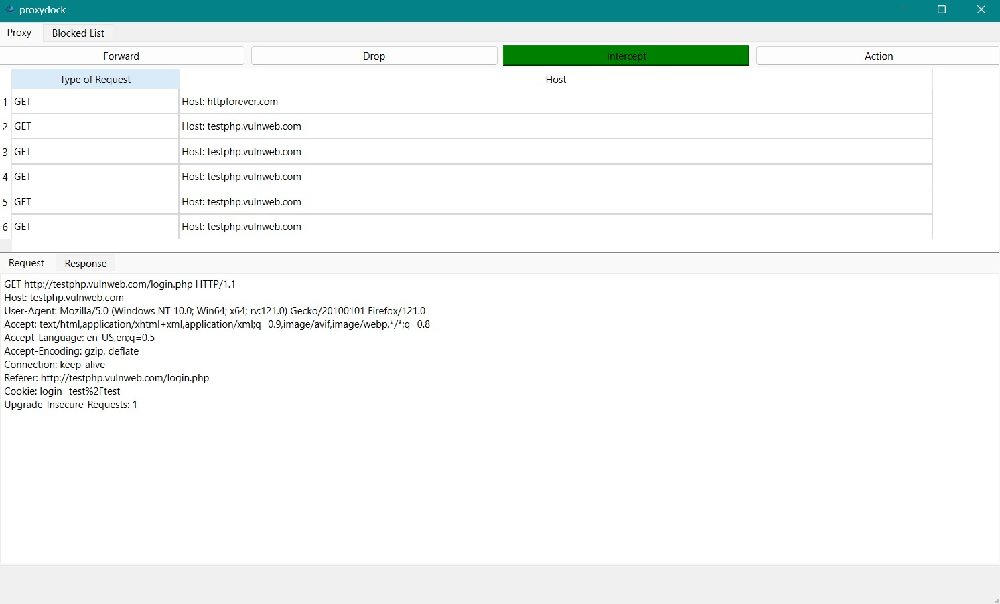
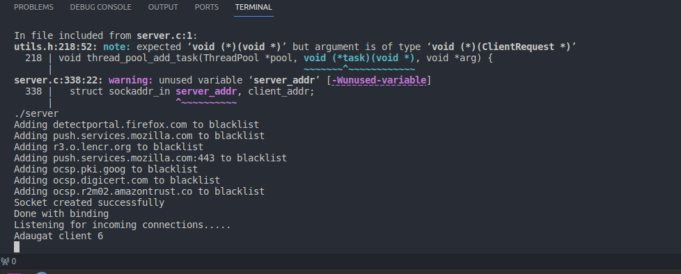
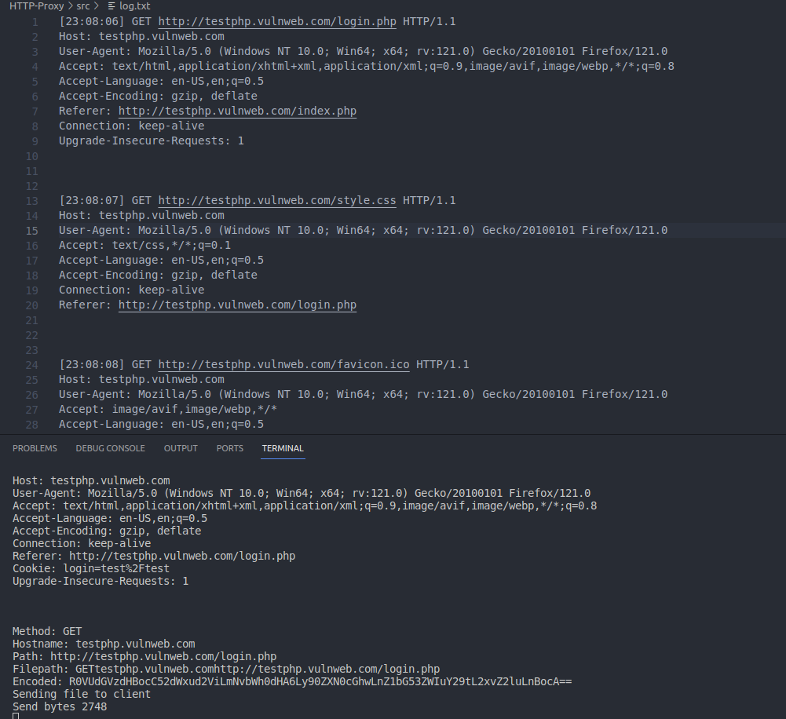
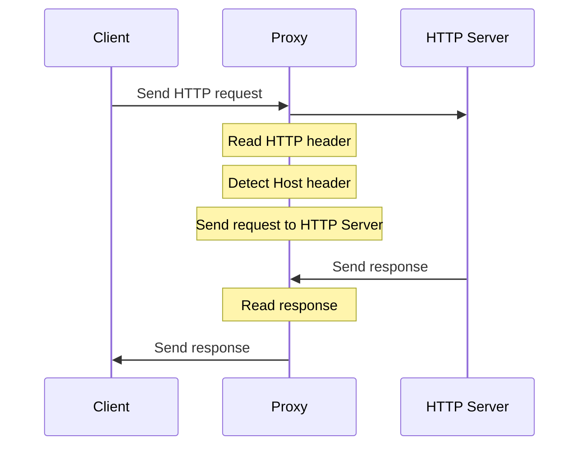

# HTTP-Proxy

<p align="center">
  
</p>

## Project Documentation

You can find the project documentation here: [file](./proxydock_srd.pdf).

## Overview

**proxydock** is a C/C++ and Qt-based software application designed to act as an intermediary between clients and servers over the HTTP protocol. It facilitates the forwarding of HTTP requests and responses, enabling users to access web content securely and anonymously. This software application acts as a reliable gateway; proxydock ensures communication between clients and servers while maintaining the utmost privacy and confidentiality for end-users, also providing a GUI for easier use.

## Features
- Proxy Server Configuration
- Request Routing 
- Caching (based on connection and file access time)
- Protocol Support (HTTP/1.0, HTTP/1.1, HTTP/2)
- Content Filtering
- Traffic Inspection and Manipulation

## Installation

Before installing, ensure you have the following dependencies:

- [GCC](https://gcc.gnu.org/) (GNU Compiler Collection)
- [Make](https://www.gnu.org/software/make/) (GNU Make)

### Clone the Repository

```bash
git clone https://github.com/Sergiuas/HTTP-Proxy.git
cd HTTP-Proxy/src/
```

### Build and Run
```bash
make
make run
```
Build and run the client side app using a qt and c++ ide such as Qt Creator.


### Good sites for testing
http://www.testingmcafeesites.com/index.html (and the links you find here)
http://testphp.vulnweb.com/login.php
http://httpforever.com/
http://http-textarea.badssl.com/

### Project flow

*Client interface.*



*Blacklist initialisation.*



*Log.*



## Arhitecture



##
_Project completed within the PSO course by Amzuloiu Sergiu and Racianu Gabriel under the guidance of Vaman Adina._
