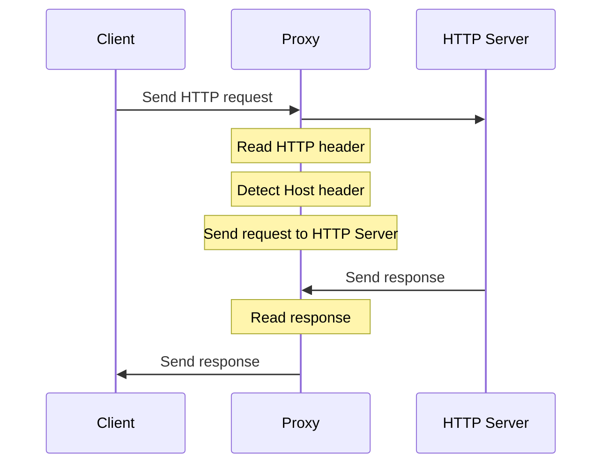
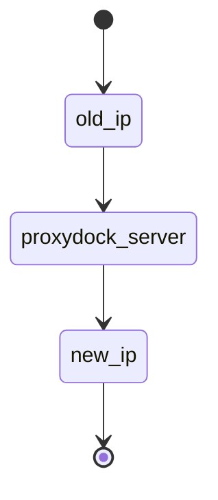

# HTTP-Proxy

  

## Table of Contents

1. [Version Table](#version-table)
    
2. [Introduction](#introduction)
   2.1 [Project Overview](#project-overview)
   2.2 [Objective](#objective)

4. [Functional Requirements](#functional-requirements)

5. [Non-Functional Requirements](#non-functional-requirements)

6. [Technical Requirements](#technical-requirements)

## 1. Version Table 

| Date       | Version  | Notes                                                   |
| :----------|:---------|:--------------------------------------------------------|
| 11/7/2023  | 1.0      | - Created repository                                    |
|            |          |  - Added first version of product requirements document |

### 2.1 Project Overview
**proxydock** is a software application designed to act as an intermediary between clients and servers over the HTTP protocol. It facilitates the forwarding of HTTP requests and responses, enabling users to access web content securely and anonymously. 
This software application acts as a reliable gateway, proxydock ensures communication between clients and servers while maintaining the utmost privacy and confidentiality for the end-users, also providing an gui for easier use.

### 2.2 Objective
The fundamental objective of proxydock is to act as a stand-in user, effectively preserving the privacy, confidentiality of the real client and allowing him to track the traffic. 
The application allows users to browse the internet, access web services, and communicate with servers, while providing useful functionalities. 

##  3.  Functional Requirements
- Intercept and inspect HTTP traffic for security and monitoring purposes.
- Enable content filtering and access control for users on a network.
- Editing/adding headers

## 4. Non-Functional Requirements
- Possibility of decompressing gzip/base64

## 5. Architecture

## 6. Technical Requirements

