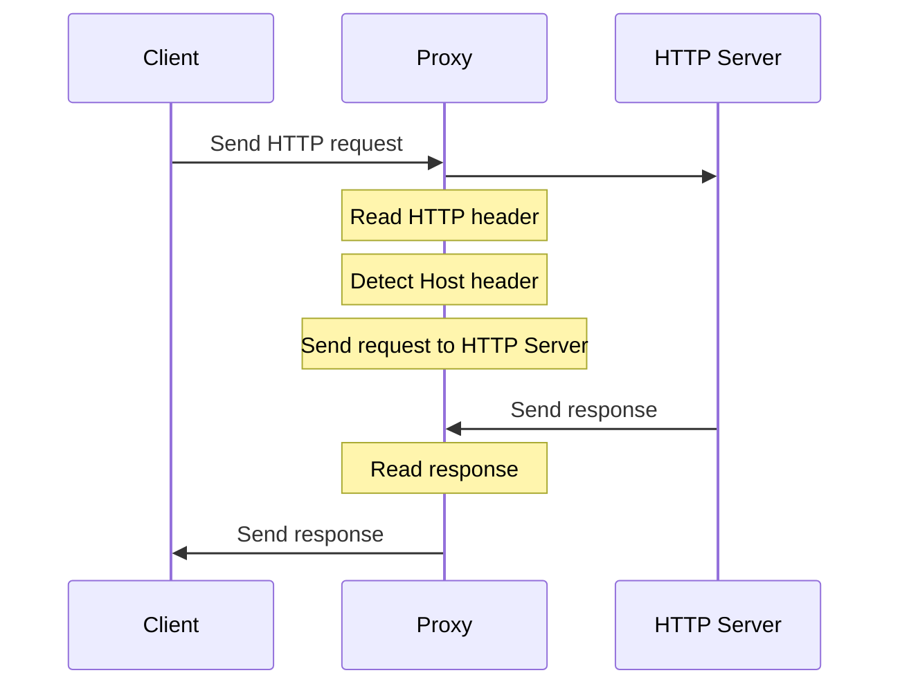
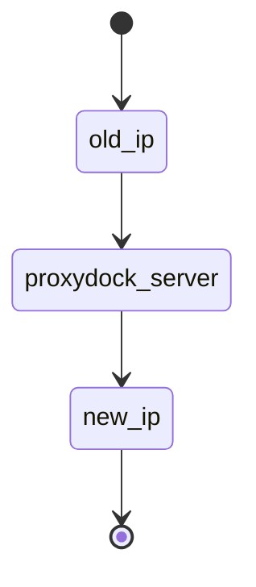

# HTTP-Proxy

  

## Table of Contents

1. [Version Table](#version-table)
    
2. [Introduction](#introduction)
   2.1 [Project Overview](#project-overview)
   2.2 [Objective](#objective)

4. [Functional Requirements](#functional-requirements)

5. [Non-Functional Requirements](#non-functional-requirements)

6. [Technical Requirements](#technical-requirements)

## 1. Version Table 

| Date       | Version  | Notes                                                   |
| :----------|:---------|:--------------------------------------------------------|
| 7/11/2023  | 1.0      | - Created repository                                    |
|            |          | - Added first version of product requirements document  |
| 20/11/2023 | 1.1      | - Created a singlethreaded version of the app           |
| 1/12/2023  | 1.2      | - Created a multithreaded version of the app            |

## 2. Introduction

### 2.1 Project Overview
**proxydock** is a software application designed to act as an intermediary between clients and servers over the HTTP protocol. It facilitates the forwarding of HTTP requests and responses, enabling users to access web content securely and anonymously. 
This software application acts as a reliable gateway, proxydock ensures communication between clients and servers while maintaining the utmost privacy and confidentiality for the end-users, also providing an gui for easier use.

### 2.2 Objective
The fundamental objective of proxydock is to act as a stand-in user, effectively preserving the privacy, confidentiality of the real client and allowing him to track the traffic. 
The application allows users to browse the internet, access web services, and communicate with servers, while providing useful functionalities. 

##  3.  Functional Requirements

#### 3.1 Proxy Server Configuration
- Users should be able to configure proxy server settings, including hostname, port, and protocol
#### 3.2 Request Routing
- The app should route HTTP requests from clients to the specified destination server.
#### 3.3 Caching
- Ability to cache responses to reduce latency and improve performance.
#### 3.4 Compression and Decompression:
- Support for compressing and decompressing HTTP content, such as GZIP.
#### 3.5 Protocol Support
- Handle various HTTP and proxy protocols, including HTTP/1.0, HTTP/1.1, and HTTP/2.
#### 3.6 Content Filtering
- Offer content filtering options to block or filter specific websites or content types.
#### 3.7 Traffic Inspection and Manipulation:
- Allow for the inspection and manipulation of HTTP requests and responses, which can be useful for debugging or security purposes.
- Editing/adding headers

## 4. Non-Functional Requirements

#### 4.1 Performance
##### Response Time
- Define the maximum acceptable response time for processing requests.
##### Throughput
- Specify the desired level of concurrent connections and requests the proxy should handle.
##### Scalability
- Determine the ability of the app to scale with increased demand.

#### 4.2 Interoperability
- Ensure that the app can work with a variety of web browsers, operating systems, and other HTTP clients.
- Support for industry standards and protocols.

#### 4.3 Documentation
- Specify documentation requirements, including user manuals, API documentation, and code comments.

#### 4.4 Compliance with Web Standards
- Ensure that the app complies with HTTP and web standards, including HTTP/1.1, HTTP/2, and WebSocket protocols.

## 5. Architecture

## 6. Technologies used
C/C++/Qt

##
_Project completed within the PSO course by Amzuloiu Sergiu and Racianu Gabriel under the guidance of Vaman Adina._
